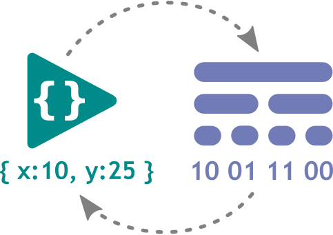

<div align="center">



# Typed Array Buffer Schema

## A Schema based Object to Buffer converter

#### Easily convert/compress your JavaScript Objects to Binary Data using a simple to use Schema.

[](https://www.npmjs.com/package/@geckos.io/typed-array-buffer-schema)
[](https://github.com/geckosio/typed-array-buffer-schema/actions?query=workflow%3ACI)
[](https://github.com/geckosio/typed-array-buffer-schema/commits/master)
[](https://www.npmjs.com/package/@geckos.io/typed-array-buffer-schema)
[](https://codecov.io/gh/geckosio/typed-array-buffer-schema)
[](https://www.typescriptlang.org/)

</div>

---

## Introduction

Checkout this short introduction video on YouTube!

https://youtu.be/TBd1miOrLPQ

## Install

Install from npm.

```console
npm install @geckos.io/typed-array-buffer-schema
```

Or use the bundled version.

```html
<script src="https://unpkg.com/@geckos.io/typed-array-buffer-schema@1.0.1/bundle/typed-array-buffer-schema.js"></script>
<script>
  const { BufferSchema, Model }  = Schema
  const { uint8, int16, uint16, int64, string8,, ...more } Schema
</script>
```

## Snapshot Interpolation

You can easily combine this library with the Snapshot Interpolation library [@geckos.io/snapshot-interpolation](https://www.npmjs.com/package/@geckos.io/snapshot-interpolation).

## Usage

#### model.js

```js
import { BufferSchema, Model } from '@geckos.io/typed-array-buffer-schema'
import { uint8, int16, uint16, int64, string8 } from '@geckos.io/typed-array-buffer-schema'

const playerSchema = BufferSchema.schema('player', {
  id: uint8,
  name: { type: string8, length: 6 },
  x: { type: int16, digits: 2 },
  y: { type: int16, digits: 2 }
})

const towerSchema = BufferSchema.schema('tower', {
  id: uint8,
  health: uint8,
  team: uint8
})

const mainSchema = BufferSchema.schema('main', {
  time: int64,
  tick: uint16,
  players: [playerSchema],
  towers: [towerSchema]
})

export const mainModel = new Model(mainSchema)
```

#### server.js

```js
import { mainModel } from './model'

const gameState = {
  time: new Date().getTime(),
  tick: 32580,
  players: [
    { id: 0, name: 'Mistin', x: -14.43, y: 47.78 },
    { id: 1, name: 'Coobim', x: 21.85, y: -78.48 }
  ],
  towers: [
    { id: 0, health: 100, team: 0 },
    { id: 1, health: 89, team: 0 },
    { id: 2, health: 45, team: 1 }
  ]
}

const buffer = mainModel.toBuffer(gameState)

// toBuffer() shrunk the byte size from 241 to only 56
// that is -77% compression!
console.log(JSON.stringify(gameState).length) // 241
console.log(buffer.byteLength) // 56

// send the buffer to the client (using geckos.io or any other library)
sendMessage(buffer)
```

#### client.js

```js
import { mainModel } from './model'

onMessage(buffer => {
  // access your game state
  const gameState = mainModel.fromBuffer(buffer)
})
```

## DataViews

A list of all supported dataViews

```js
// https://developer.mozilla.org/en-US/docs/Web/JavaScript/Typed_arrays

/** -128 to 127 (1 byte) */
export const int8 = { _type: 'Int8Array', _bytes: 1 }
/** 0 to 255 (1 byte) */
export const uint8 = { _type: 'Uint8Array', _bytes: 1 }

/** -32768 to 32767 (2 bytes) */
export const int16 = { _type: 'Int16Array', _bytes: 2 }
/** 0 to 65535 (2 bytes) */
export const uint16 = { _type: 'Uint16Array', _bytes: 2 }

/** -2147483648 to 2147483647 (4 bytes) */
export const int32 = { _type: 'Int32Array', _bytes: 4 }
/** 0 to 4294967295 (4 bytes) */
export const uint32 = { _type: 'Uint32Array', _bytes: 4 }

/** -2^63 to 2^63-1 (8 bytes) */
export const int64 = { _type: 'BigInt64Array', _bytes: 8 }
/** 0 to 2^64-1 (8 bytes) */
export const uint64 = { _type: 'BigUint64Array', _bytes: 8 }

/** 1.2×10-38 to 3.4×1038 (7 significant digits e.g., 1.123456) (4 bytes) */
export const float32 = { _type: 'Float32Array', _bytes: 4 }

/** 5.0×10-324 to 1.8×10308 (16 significant digits e.g., 1.123...15) (8 bytes) */
export const float64 = { _type: 'Float64Array', _bytes: 8 }

/** 1 byte per character */
export const string8 = { _type: 'String8', _bytes: 1 }
/** 2 bytes per character */
export const string16 = { _type: 'String16', _bytes: 2 }
```
